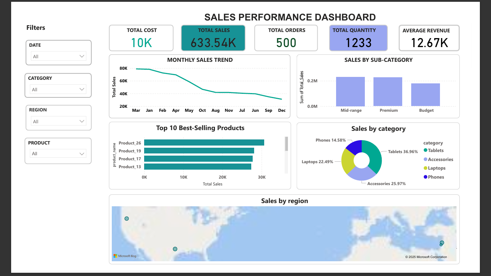

# Retail Sales Performance & Business Intelligence Dashboard

## Project Overview

**Role:** Data Analyst
**Tools:** Microsoft Power BI, Power Query, DAX
**Focus:** Sales Performance, Product Analysis, Customer Insights & Business Reporting

### Business Problem

A retail business had sales, customer, product and order data but lacked an interactive reporting solution for monitoring business performance. Management needed a simple way to understand revenue trends, product performance, customer behaviour and regional sales performance.

### Objective

Develop an interactive Power BI dashboard that transforms raw retail data into actionable business insights and enables management to monitor key performance indicators and identify areas of growth and underperformance.

### What I Built

I cleaned and transformed the underlying data using **Power Query**, developed a structured Power BI data model, and created **DAX measures** to support interactive business analysis.

The final solution contains multiple analytical views:

* **Executive Summary** — overall sales performance and KPIs
* **Product & Category Insights** — product, category and profitability analysis
* **Customer/Order Insights** — customer behaviour and order performance
* **Product Drill-Through** — detailed product-level analysis

### Key KPIs

The dashboard tracks:

* Total Sales
* Total Cost
* Total Orders
* Total Quantity
* Average Revenue per Customer
* Profit
* Profit Margin
* Average Order Value
* Total Customers
* Returning Customers
* New Customers MTD

### Key Analysis

The dashboard enables users to:

* Monitor monthly sales trends
* Identify the top-selling products
* Compare sales across categories and sub-categories
* Evaluate regional sales performance
* Analyse product profitability and profit margins
* Examine customer value and returning-customer behaviour
* Compare new versus returning customers
* Drill into individual product performance
* Filter results by product, category, region and date

### Business Value

The dashboard converts raw transactional data into a management reporting tool that can help decision-makers:

**Identify high-performing products** → support inventory and sales decisions

**Monitor category and regional performance** → identify growth opportunities

**Track profitability** → understand which products contribute most to business performance

**Monitor customer behaviour** → support retention and customer-growth strategies

**Track trends over time** → identify changes in business performance earlier

### Deliverables

* Interactive Power BI dashboard
* Data cleaning and transformation
* Data model
* DAX calculations and KPIs
* Product and category analysis
* Customer and order analysis
* Interactive filters and drill-through analysis
* Business-focused visual reporting

### Portfolio

**GitHub:** github.com/josephampofo-da/Retail-Sales-Performance-Dashboard

### Why This Project Matters

This project demonstrates my ability to move beyond creating visualizations and use **Excel/Power BI-style business intelligence techniques to turn raw business data into decision-ready reporting.**

### 🟦 Sales Overview

### 🟩 Customer Insights

### 🟧 Product Performance

