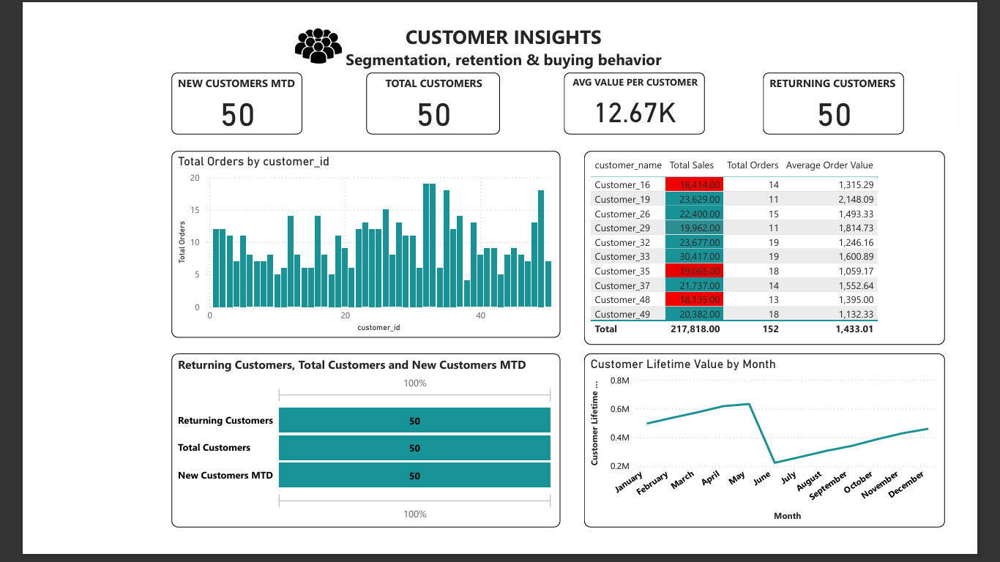
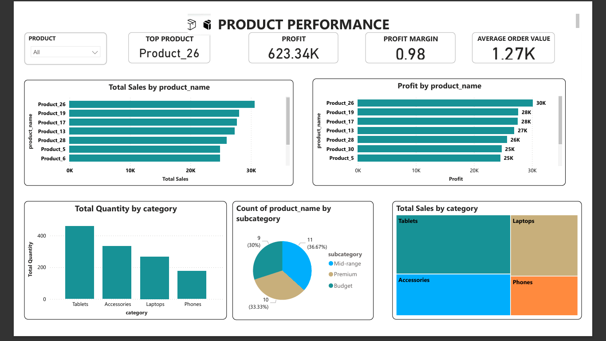

# Retail-Sales-Performance-Dashboard
A fully interactive analytics dashboard that provides insights into retail sales performance, customer behavior, and business growth trends. This project demonstrates practical end-to-end data analytics: cleaning, modeling, analysis, DAX, visualization, and storytelling.
📌 Project Overview

Retail businesses generate data every day — orders, customers, products, and sales. But raw data alone cannot guide strategic decisions.
This project solves that by transforming messy, unstructured retail data into a professional BI dashboard that enables stakeholders to:
Track revenue and sales performance
Understand customer behavior
Identify best-selling products
Monitor store or category performance
Forecast sales
Perform segmentation and what-if analysis

The dashboard is designed for business owners, sales managers, marketing teams, and analysts who want fast insights to grow revenue.
🎯 Business Problem
The retail company needed a centralized analytics solution to answer these key questions:
How are sales performing across different months, products, and customer groups?
Which products contribute the most to revenue?
How many new vs. repeat customers are we getting?
What customer segments drive the highest order value?
What would happen if discounts were increased or decreased?

🧹 Data Cleaning & Transformation (Power Query)

Power Query was used to:
Remove duplicates
Clean column names
Fix data types (dates, decimals, text)
Split product hierarchy (category → subcategory → product)
Create a proper calendar table
Merge customer and orders tables
Handle missing values
Add custom calculated columns
📊 Dashboard Features

✔ 1. Sales Overview Page
Total Sales
Total Orders
Total Customers
Average Order Value
Sales Trend by Month
Top 10 Products
Sales by Region or Category

✔ 2. Customer Insights Page
New vs. Repeat Customers (DAX)
Customer Lifetime Value
Customer Segmentation
Top Customer Profiles
Repeat Purchase Behavior Analysis

✔ 3. Product Performance Page
Best-selling products
Low-selling products
Contribution to revenue

## 📸 Dashboard Screenshots

## 📸 Dashboard Screenshots

### 🟦 Sales Overview

### 🟩 Customer Insights

### 🟧 Product Performance

